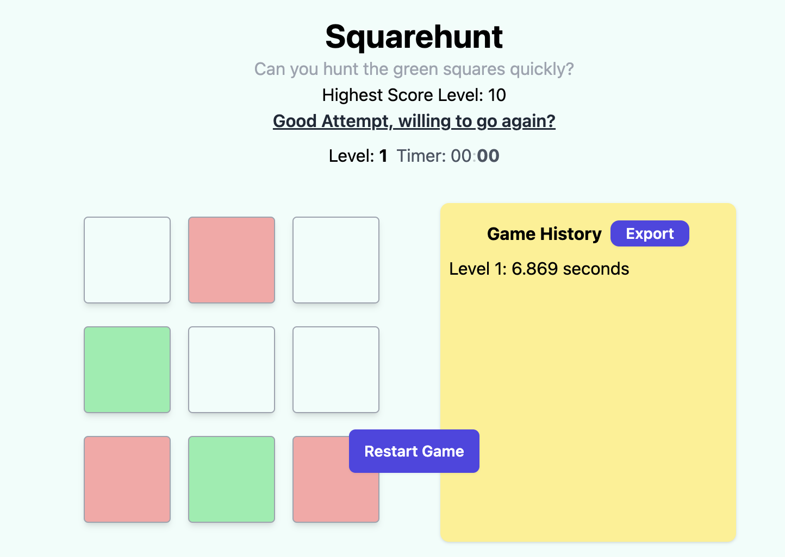
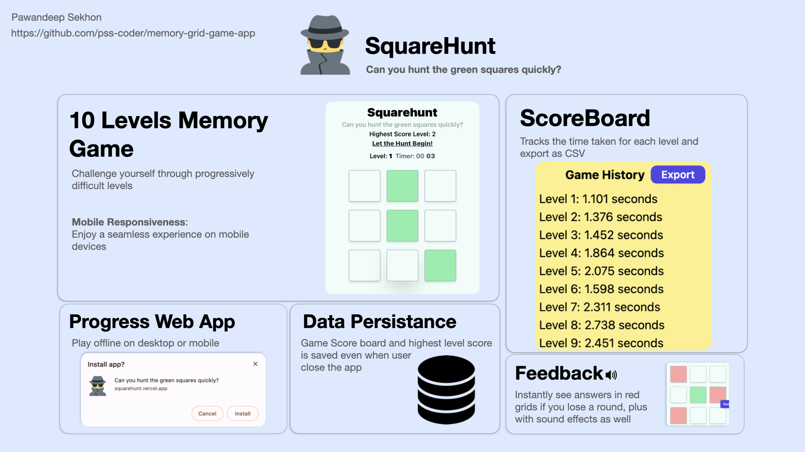

# SquareHunt

Can you hunt the green squares quickly and complete all 10 levels?


[Demo Video](Demo_Video.mp4)

## Features


- **10 Levels Memory game**: Challenge yourself through progressively difficult levels.
- **Sound Effects**: Enjoy immersive sound effects for winning a level, clicking squares, losing a round, and completing all 10 levels.
- **Feedback**: Instantly see answers in red grids if you lose a round.
- **Retry Mechanism**: Restart or play again after winning or losing.
- **Score Tracking**: Keep track of your highest score based on the highest level completed.
- **Mobile Responsiveness**: Enjoy a seamless experience on mobile devices.

### What's unique about SquareHunt


- **Score Board**: Tracks the time taken for each level.
- **Export Feature**: Export your scores in CSV format.
- **Persistent Data via Local Storage**: Your progress is saved even when you close the app.
- **Progressive Web App Feature**: Play offline on desktop or mobile.

## Challenges

- Implementing logic for identifying clicked squares and structuring the app into different components (Main App View, GameBoard, Square), overcame it by first working on UI, and working on first few levels.
- Ensuring code readability and maintainability, transitioning from State to UseReducer as the codebase grew.


### Code Snippt 
Using Reducer for Game Logic to handle events on game
```js
function reducer(state, action) {
  const {type} = action

  switch(type) {
    case 'start': {
      return {...state, startGame: true}
    }
    case 'generate_green_square': {
      // Update state with green squares
      const generatedGreenSquares = generateGreenSquares(state.selectedLevel.square, 0, state.selectedLevel.grid);
      return {
        ...state,
        greenSquares: generatedGreenSquares,
        displayGreenSquares: generatedGreenSquares,
        timer: 4
      }
    }
    case 'increment': {
      if (state.level === levels.length) return;
      return {
        ...state,
        clickedSquares: [],
        greenSquares: [],
        displayGreenSquares: [],
        level: state.level + 1,
        selectedLevel: levels[state.level],
        gameState: null
      }

    }
    case 'check_win': {
      // only if number of clicks matches selected squares required
        const disableClick = true
        var gameState = null
        var displayAnswer = null

        const isEqual = areArrayEqual(state.clickedSquares, state.greenSquares);


        if (isEqual) {

          if (state.level === levels.length) {
            gameState = 'gameWin'
            playSound('win');

          } else {
            gameState = 'levelComplete'
            playSound('level')
          }

        } 
        else {
          gameState = 'levelLoss';
          displayAnswer = state.greenSquares
          playSound('lose');
        }

        return {
          ...state,
          disableClick: disableClick,
          gameState: gameState,
          displayGreenSquares: displayAnswer != null ? displayAnswer : state.displayGreenSquares
        }

      }
    //rest of code found in src/GameLogic.js
    }
  }
```

## Installation

1. Clone the repository: `git clone <repository-url>`
2. Navigate to the project directory: `cd memory-grid-game-app`
3. Install dependencies: `npm install`
4. Start the development server: `npm start`
5. Access the application in your browser at [http://localhost:3000](http://localhost:3000)

## Available Scripts

### `npm start`

Runs the app in development mode.
Open [http://localhost:3000](http://localhost:3000) to view it in your browser.

The page will reload when you make changes.
You may also see any lint errors in the console.

### `npm run build`

Builds the app for production to the `build` folder.
It correctly bundles React in production mode and optimizes the build for the best performance.

The build is minified, and the filenames include hashes.
Your app is ready to be deployed!

See the section about [deployment](https://facebook.github.io/create-react-app/docs/deployment) for more information.

## Tech Stack

- **Framework**: React
- **Storage**: Local Storage
- **Deployment**: Vercel

## Sound Effects Source

[https://freesound.org/](https://freesound.org/)

## What's Next

- **Play with Friends**: Compete with friends and see who is the fastest.

## Tested on
- **MacOS 13.6.3**: Chrome, Safari
- **iPhone iOS 17.4.1**: Chrome, Safari

### Test Cases
- Find in `src/__tests__`.


### Future Implementation
- Push Notifications - remind user to play at periodically
- Stats Dashboard - Tabulate Data, after x attempts and tell user meaningful data
- Play with Friend - Play alongside a friend, and compete who is fastest to hunt
